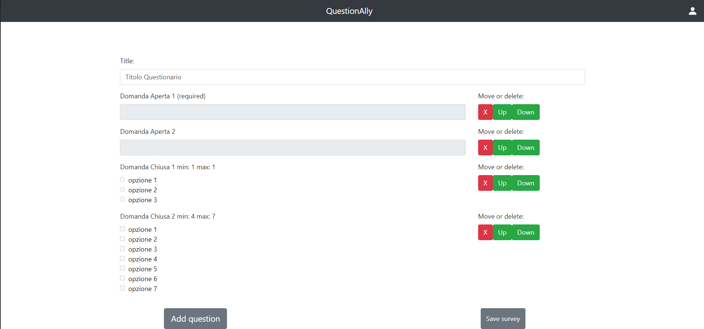

# Exam #1234: "Exam Title"
## Student: s281689 Castrignanò Alberto 

## React Client Application Routes

- Route `/login`: here an admin can log in
- Route `/home`: here any user can view the list of available surveys. this is the main website page
- Route `/dashboard/check/:id`: here an admin can view the answers to survey with given id
- Route `/compile/:id`: here any user can compile the survey with given id
- Route `/new`: here an admin can add a new survey
- Route `/dashboard`: here an admin can view its surveys. this is the main website page for a logged user
- Route `/thanks`: this is a message page showed when an user answers to a survey
- Route `/done`: this is a message page showed when an admin adds a survey
- Route `/aborted`: this is a message page for operations that don't go well for server problems
- Route `/`: this route is used for redirecting or showing that an url doesn't exist

## API Server

- POST `/api/sessions`
  - request body has user data
  - response body has user data
- DELETE `/api/sessions/current`
- GET `/api/sessions/current`
  - response body has user data
- GET `/api/surveys/`
  - response body has list of {id, title} surveys
- GET `/api/user/surveys`
  - request parameter is user id
  - response body has list of {id, title} surveys
- GET `/api/surveys/:id`
  - request parameter is id of survey
  - response body has list of {id, title, questions} surveys, where questions is a list with ( {position, {id, text, required, position}} or {position, {id, text, min, max, position, options}}, where options is a list of {id, question, text} ) questions ordered by position
- GET `/api/teapot`
  - response is the teapot easter egg with code 418
- GET `/api/surveys/answers/:id`
  - request parameter is id of survey
  - response body has list of {title, questions} questions of a survey, where questions is a list of {position, question}, where
    question is {id, text, position, answer} if open question, or {id, text, position, options} if closed question, where options
    is a list of {id, text, value}
- POST `/api/surveys/compile`
  - request body has {surveyId, name, answers}, where answers is a list of {position, answer} if it is an answer to an open question, or {position, options} if it is an answer to a closed question, where options is {optionId, value} or {optionId}, where in the second case value is assumed to be false
- POST `/api/surveys/new`
  - request body has {title, questions}, where questions is a list of {text, position, required} if it is an open question, or
  {text, position, min, max, options} if it is a closed question, where options has a list of {text}

## Database Tables

- Table `questionario` - contains id(int), utente(int) FOREIGN KEY, titolo(text), contains the references to surveys
- Table `domanda_aperta` - contains id(int), questionario(int) FOREIGN KEY, testo(text), obbligatorio(int), posizione(int), contains the open questions for a given survey
- Table `domanda_chiusa` - contains id(int), questionario(int) FOREIGN KEY, testo(text), min(int), max(int), posizione(int), contains the closed questions for a given survey
- Table `opzione` - contains id(int), domanda(int) FOREIGN KEY(domanda_chiusa), testo(text), contains the options of a given closed question
- Table `compilazione` - contains id(int), questionario(int) FOREIGN KEY, nome(text), contains the reference of a compilation of a given survey from any user 
- Table `risposta_aperta` - contains compilazione(int) FOREIGN KEY, domanda(int) FOREIGN KEY, testo(text), contains the answer to an open question for a given compilation
- Table `risposta_chiusa` - contains compilazione(int) FOREIGN KEY, opzione(int) FOREIGN KEY, selezione(int), contains the selection of an option of a closed question for a given compilation 
- Table `users` - contains id(int), username(text), hash(text), contains the users

## Main React Components

- `AdminApp` (in `AdminApp.js`): used to show to an admin the list of its created surveys, which are clickable
- `AdminCheck` (in `AdminApp.js`): used to show to an admin the answers to a survey
- `OpenQuestion` (in `AdminApp.js`): used to render an open question in Filling
- `ClosedQuestion` (in `AdminApp.js`): used to render a closed question in Filling
- `AdminAdd` (in `AdminApp.js`): used to allow the admin to add a new survey
- `Aborted` (in `Aborted.js`): used to show an error message for server unavailability after operations
- `Done` (in `Done.js`): used to show a message for a completed survey adding
- `LoadingMessage` (in `LoadingMessage.js`): used to show the loading message
- `LoginForm` (in `LoginForm.js`): used to show the login form
- `PageNotFound` (in `PageNotFound.js`): used to show the page not found error
- `Qnavbar` (in `Qnavbar.js`): used to render the navbar common to all pages
- `Thanks` (in `Thanks.js`): used to show a message for a completed survey compiling
- `UserApp` (in `UserApp.js`): used to show the list of available surveys in homepage
- `Filling` (in `UserApp.js`): used to let an user filling a survey
- `OpenQuestion` (in `UserApp.js`): used to render an open question in Filling
- `ClosedQuestion` (in `UserApp.js`): used to render a closed question in Filling

## Screenshot

## Users Credentials

- AlbInit, passwordfacile, $2a$10$I.BBJUQVfyDHEkx.1/IfludL9e.AVHXGp/P2x6i0amYu5q3BgtFt6
- SonSon, p4ssw0rdd1ff1c1l3, $2a$10$yBLpMY5nylADKpwR7vmrfOZHxGyx97QqUCKImfjY1gMypeeHoqM/i
